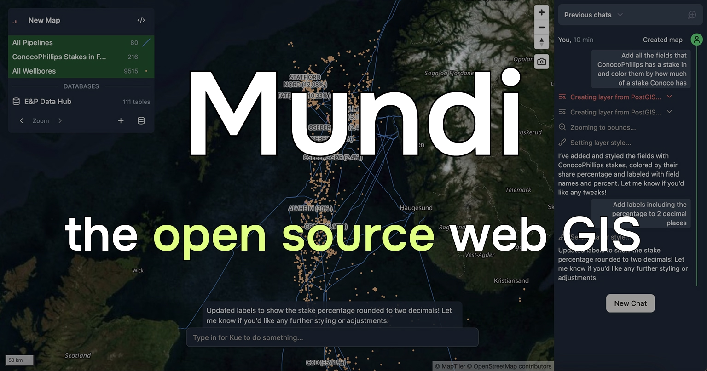

<h4 align="center">
  
  
  
  
</h4>

# Introduction

Mundi is an AI-native web GIS, credited to Roger:

- Supports vector, raster, and point cloud data
- Connects to and queries spatial databases like PostGIS
- Uses LLMs to call geoprocessing algorithms and edit symbology

You can try it for free on [Mundi cloud at `app.mundi.ai`](https://app.mundi.ai),
our hosted cloud service. [Mundi](https://github.com/Ingabe/mundi.ai)
is also available as a self-hosted set of Docker images, with full support for local LLMs.

## Starting on Mundi cloud

You can sign up for free at [app.mundi.ai](https://app.mundi.ai) to try out Mundi and read some guides to learn what's possible:

- [Making your first map](https://docs.mundi.ai/getting-started/making-your-first-map/) - Learn how to create your first map in Mundi with sample data and basic visualization.
- [Connecting to PostGIS](https://docs.mundi.ai/guides/connecting-to-postgis/) - Mundi can connect to, add layers from, and query external PostGIS databases.

## Self-hosting Mundi

Mundi can run entirely on your local machine with local LLMs.

We have a [tutorial on self-hosting Mundi](https://docs.mundi.ai/deployments/self-hosting-mundi). Self-hosting requires
a good computer/server, git, and Docker. You can optionally connect it to a local LLM (or any
provider that supports the chat completions API).

Give us a [star on GitHub](https://github.com/Ingabe/mundi.ai),
[join our Discord to talk to us](https://discord.gg/V63VbgH8dT), or
[create a pull request](https://github.com/Ingabe/mundi.ai/pulls) to contribute back!

## Contributing

We welcome contributions to Mundi! The best contributions are often a blend of your inspiration, plus our implementation guidance. Discussing ideas with us [in our Discord](https://discord.gg/V63VbgH8dT) or on GitHub issues is a great way to socialize a potential contribution.

1. We value end-to-end test coverage as a way of ensuring code quality. Great contributions should come with great tests, but we know 100% code coverage is not the goal.

2. Contributions that add significant dependencies (e.g. new Docker images) will be weighed against the cost it adds to self-hosting. Self-hosted Mundi is lightweight, which makes it accessible to a wide range of users on varying hardware.

## Security

Ingabe takes potential security issues seriously. If you have any concerns about Mundi or believe you have uncovered a vulnerability, please get in touch via our Discord or GitHub issues (for non-sensitive matters).

Please do not file security-related GitHub issues, because this may compromise the security of our users. Instead, reach out to us directly.

## License

Optionally, Mundi can use [QGIS](https://qgis.org/) for geoprocessing.
[The code that links with QGIS](./qgis-processing) is licensed
as [GPLv3](./qgis-processing/LICENSE).
