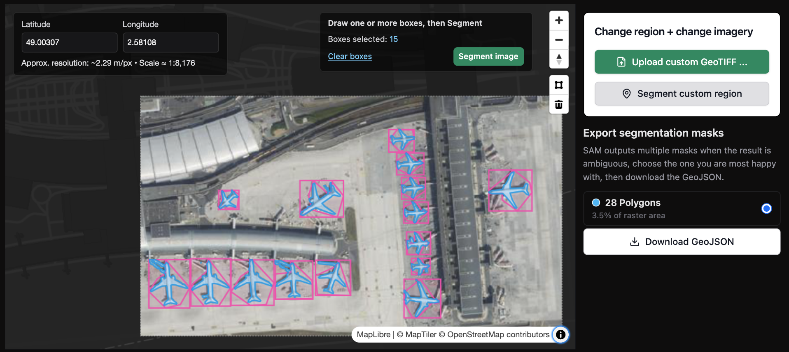
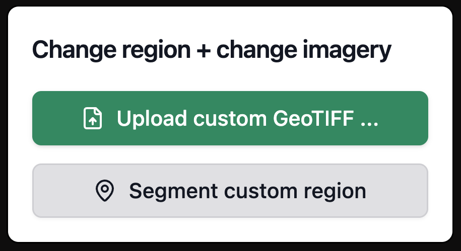
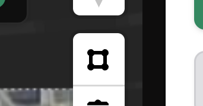
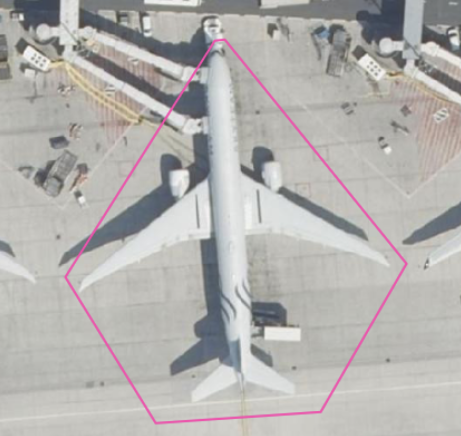
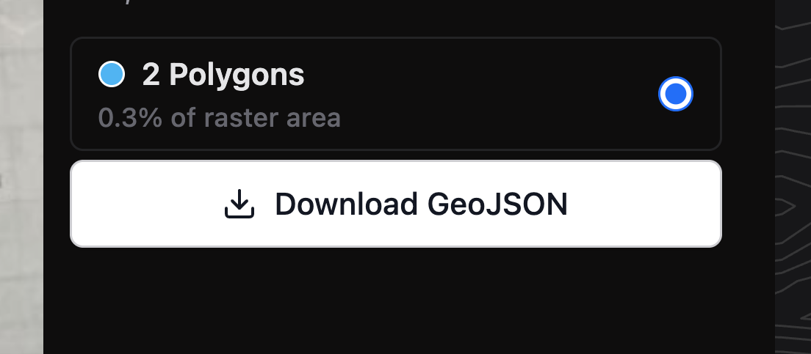

You can run Segment Anything [online in Mundi](https://app.mundi.ai/tools/segment-anything/airplanes) to extract polygons from aerial
imagery, satellite imagery, and traditional maps. These polygons are already processed
in Mundi and downloadable as vector spatial data (GeoJSON).

The Segment Anything tool available in Mundi uses Meta's Segment Anything Model. To
use the model, draw a bounding box around each object you want to segment. Once you
have segmented everything, you can download the output as a GeoJSON.

You can access the Segment Anything tool online, and do not need to own a GPU or download
any model. You can upload any imagery you need to segment or use our catalogue of imagery.
Using the Segment Anything tool [requires a Mundi subscription, starting at $45/month](https://mundi.ai/pricing).
There are sample locations with imagery loaded you can evaluate in Mundi.

## Introduction to Segment Anything

[Segment Anything](https://segment-anything.com/) is a foundation model from Meta AI that predicts object masks given simple
prompts such as points or boxes. We adapt Segment Anything for geospatial workflows by
supporting GeoTIFFs and satellite imagery as inputs so that the polygons are already
georeferenced, and by supporting GeoJSON exports that you can add to any GIS platform such as [Mundi](https://mundi.ai).

## Adding data to segment

You can [upload your own GeoTIFF to the Segment Anything tool](https://app.mundi.ai/tools/segment-anything/geotiff)
or work with our own [catalogue of aerial imagery](https://app.mundi.ai/tools/segment-anything/bbox).
Selecting your own region or adding your own imagery
requires a [Mundi Basic subscription](https://mundi.ai/pricing). If you first want to evaluate the Segment
Anything model, you can try our free public examples.

:::note
If your maps are not yet georeferenced, try our [AI Georeferencer.](https://docs.mundi.ai/guides/ai-georeferencer-for-aerial-imagery/).
:::

### Free public examples

You can evaluate the Segment Anything tool without a paid account using our sample
imagery of popular targets. If you
want to evaluate our tool on anything specific, reach out to us on Discord or GitHub.

1. [Detect Aircraft in Aerial Imagery](https://app.mundi.ai/tools/segment-anything/bbox/airplanes)
2. [Detect Buildings in Aerial Imagery](https://app.mundi.ai/tools/segment-anything/bbox/buildings)

### Upload your own GeoTIFF

Want to try custom imagery? You can upload any GeoTIFF and segment your own area of interest directly in your browser: https://app.mundi.ai/tools/segment-anything/geotiff

## How to run the Segment Anything tool

Unlike other Segment Anything applications, there are no downloads needed to run
Mundi's Segment Anything tool. You only need to find the imagery you want to segment,
draw bounding boxes, and download your preferred result.

Unlike other applications of Segment Anything, this tool requires creating a bounding
box around each target. We found that allowing the model to predict more targets led
to much noisier results, requiring more cleanup time.

### Select the bounding box tool

To begin creating a bounding box, you need to select this icon. It will turn light grey
when selected:

### Draw a bounding box around each target

Once the bounding box tool is active, left-click to create a bounding
box. Make sure to keep the box close to your target. Once you are done, either
double left click or right click to save the box. Once you save a box, the model will
run.

### Save the output

Once you segment one target, you can either draw more boxes around more targets or
download the polygons as a GeoJSON.

To download, select the **Download GeoJSON** button on the right side of the image.

